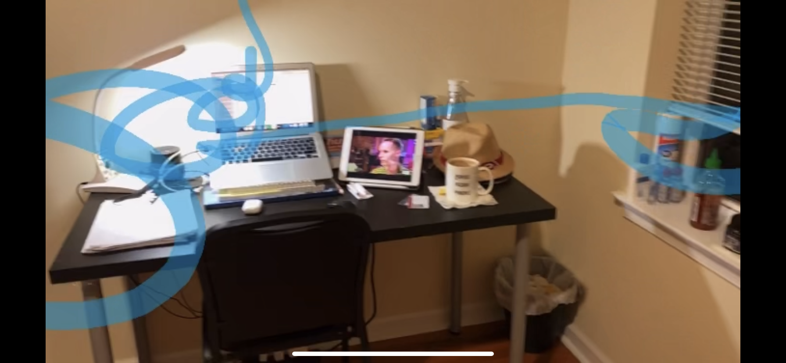

# drawing-in-space-AR
An app that lets you draw in space. How cool is that!
This app is just a tiny project learning another way to take advantage of the capability of world-tracking and make something cool out of it. Simple in idea but looks hella cool!

<!-- 

  

 -->

Check out the demo video here (https://youtu.be/cXQZBEAsjDA) and some snapshots of the experience:

  
  
  
  

